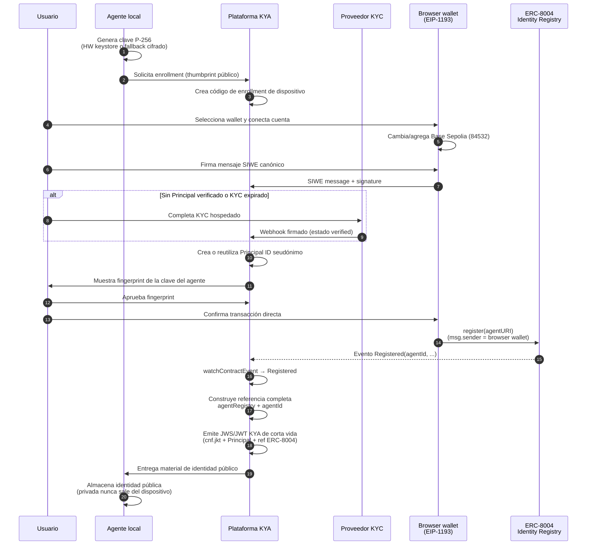
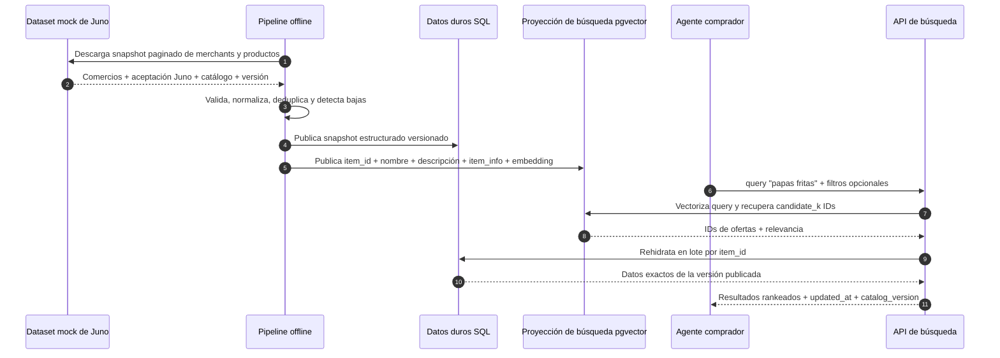

# FLOW — Autenticación KYA y descubrimiento de catálogo de merchants

## Decisión ejecutiva

**KYC es solo para personas** y, en condiciones normales, **se hace una sola vez**. La persona autoriza uno o más agentes compradores locales que corren en su PC. La plataforma KYA vincula un **Principal ID** seudónimo verificado a un **Agent ID ERC-8004** y a la **clave pública local** del agente.

La única conexión de wallet del MVP live es **`BrowserWalletConnector`**: descubre
providers inyectados, autentica con SIWE y envía directamente
`register(agentURI)` desde la misma dirección verificada. No hay abstracción de
cuenta ni sponsorship de gas; el usuario paga gas de Base Sepolia.

La búsqueda de catálogo queda separada de identidad y auth en este slice:
un agente consumidor consulta, en lenguaje natural, un catálogo de comercios
que aceptan **Juno** como proveedor o método de pago. El primer alcance usa un
**dataset mock de Juno** (10 ofertas ARS en español, varios merchants de
Argentina) cargado offline en PostgreSQL y un índice vectorial derivado. No
conecta con Juno real ni ejecuta compras o pagos.

**Dirección de arquitectura aprobada, todavía no implementada:** Juno no será
la fuente runtime. Cada merchant registrado mantendrá su feed mediante las rutas
ACP de Feeds y Products. El catálogo relacional pasará a estado actual
incremental por feed y un worker derivará embeddings desde una outbox
transaccional. La búsqueda HNSW/lexical y la hidratación SQL se conservan.

| Implementado hoy | Extensión de catálogo | Fuera de alcance |
| --- | --- | --- |
| Ceremonia de identidad (persona ↔ agente local ↔ KYA) | Dataset mock de comercios y productos Juno | Integración con la API real de Juno |
| Enrollment, credencial KYA, autenticación del agente | Pipeline offline de normalización e indexación vectorial | Checkout, captura, pago y liquidación |
| Binding Principal ID + ERC-8004 + clave local | Búsqueda semántica de productos entre merchants | AP2 y otros protocolos de pago |
| Consumo del Identity Registry curated | Resultados con precio, disponibilidad y frescura de catálogo | Deploy de registry propio; Hardhat/Foundry en runtime |

**Actores de la ceremonia (4):** Usuario · Agente local · Plataforma KYA · Proveedor KYC.  
ERC-8004 es **infraestructura interna** de Plataforma KYA, no un quinto actor de negocio.

---

## Flujo principal (happy path)



---

## Flujo implementado: búsqueda de productos con Juno mock



### Contrato de datos del mock de Juno

El dataset define el contrato sintético que consumirá el MVP en lugar de una
integración real con Juno. En este slice se carga offline y no agrega rutas HTTP
para listar o modificar merchants:

| Recurso | Datos mínimos |
| --- | --- |
| Merchant | `merchant_id`, nombre, categoría, ubicación y `payment_methods` con Juno explícito |
| Producto | `item_id`, `merchant_id`, nombre, descripción, categoría y etiquetas |
| Oferta | precio, moneda, disponibilidad y referencia al producto/merchant |
| Snapshot | `catalog_version`, `updated_at`, paginación y bajas desde la versión anterior |

Todos los datos son sintéticos: no requiere credenciales reales de Juno ni
representa disponibilidad comercial real.

### Pipeline offline e índice vectorial

1. Descarga un snapshot completo o los cambios posteriores a una versión.
2. Valida el esquema, normaliza categorías/monedas y deduplica IDs canónicos.
3. Guarda el catálogo estructurado como fuente de verdad.
4. Construye una proyección de búsqueda mínima por oferta: `item_id`, nombre,
   descripción e `item_info` textual.
5. Genera el embedding de esa proyección y publica la nueva versión de forma
   atómica.
6. Elimina o marca como no disponibles las ofertas ausentes o dadas de baja.

El pipeline corre fuera del request de búsqueda, es repetible e idempotente.
PostgreSQL y pgvector no son dos bases separadas: la proyección vectorial y los
datos duros viven en tablas con responsabilidades distintas dentro del mismo
PostgreSQL. El índice HNSW se mantiene al cambiar las filas vectoriales, pero el
pipeline sigue siendo responsable de generar los embeddings. La búsqueda
recupera candidatos por `item_id` y después rehidrata precio, moneda,
disponibilidad y merchant desde SQL en una sola operación por lote, nunca con
una consulta por resultado.

### Contrato de búsqueda para agentes

| Entrada | Salida |
| --- | --- |
| `query` libre, por ejemplo `papas fritas` | Merchant y producto/oferta canónicos |
| `top_k` opcional | Precio y moneda exactos |
| Filtros opcionales de merchant, categoría, moneda, precio o disponibilidad | Disponibilidad y aceptación de Juno |

La única superficie HTTP del catálogo será `POST /v1/catalog/search`. En este
slice es pública: no requiere KYC, sesión ni credencial KYA. La autenticación se
resolverá después como middleware sin cambiar la lógica interna de búsqueda.

La relevancia semántica sirve para recuperar candidatos por `item_id`; los
filtros y datos duros se resuelven contra el snapshot SQL de la misma versión.
La respuesta nunca inventa productos, precios o stock que no existan en el
último snapshot publicado ni entrega un candidato sin su fila relacional.

Ejemplo esperado: `papas fritas` puede recuperar ofertas llamadas “Papas
clásicas”, “Bastones de papa” o productos equivalentes por significado, y devolver
cada resultado con el merchant que lo vende y su precio vigente en el snapshot.

---

## 1. Alcance y no-objetivos

### Alcance
- Autenticar agentes compradores **locales** en el PC del usuario.
- Vincular persona verificada (Principal ID) ↔ Agent ID ERC-8004 ↔ clave pública local.
- Enrollment, rotación, revocación y autenticación challenge-response del agente ante Plataforma KYA.
- Consumir el **Identity Registry curated** ya desplegado y su ABI oficial.
- Cargar un dataset mock con merchants que aceptan Juno y sus productos, precios y disponibilidad.
- Ejecutar un pipeline offline que normaliza el catálogo y publica un índice vectorial versionado.
- Permitir que un agente consumidor recupere ofertas relevantes mediante una query libre.

### No-objetivos
- Integración con Juno real o datos comerciales reales en esta fase.
- Portal de onboarding, login o autoservicio para merchants; el alta y la
  entrega de API keys serán manuales en el MVP.
- Checkout, creación de órdenes, captura de pago o liquidación.
- AP2 u otros protocolos de pago.
- Crawling o embeddings en tiempo real dentro del request de búsqueda.
- KYC, autenticación o autorización del endpoint de búsqueda en este slice.
- Reputation Registry / Validation Registry de ERC-8004.
- Desplegar un registry ERC-8004 propio (Hardhat/Foundry **no** están en el path de runtime).
- Almacenar documentos KYC, biometría o PII en cadena o en `agentURI`.

## Arquitectura objetivo: ingesta ACP mantenida por merchants

> **Implementada en este worktree.** La fixture Juno queda como seed/test; el
> runtime usa feeds ACP current-state y la búsqueda posterior a la indexación
> se mantiene.

```mermaid
sequenceDiagram
  participant M as Merchant registrado
  participant API as API ACP
  participant DB as PostgreSQL + pgvector
  participant W as Worker de embeddings
  participant A as Agente consumidor

  M->>API: PATCH /product_feeds/{feed_id}/products
  API->>API: API key Bearer + ownership + idempotencia
  API->>DB: Merge + data_revision/search_revision + precio/stock + outbox
  API-->>M: 200 accepted
  W->>DB: Claim outbox + embedding local + upsert de proyección
  A->>API: POST /v1/catalog/search
  API->>DB: HNSW/lexical + hidratación SQL actual
  API-->>A: Resultados + data/search/index revisions; sin catalog_version
```

Reglas centrales:

- Un Variant ACP es el item vendible, identificado internamente por
  `feed_id + product_id + variant_id`.
- El PATCH es parcial: campos y productos omitidos permanecen sin cambios.
- El MVP acepta sólo `target_country=AR`, contenido español y precios `ARS`.
- Precio y stock son visibles al commit; el embedding se actualiza de forma
  eventual y nunca bloquea una actualización comercial válida.
- `discontinued` o `available=false` oculta inmediatamente el item.
- Cada merchant se da de alta manualmente y recibe una API key opaca que se
  muestra una sola vez; se persiste sólo su hash, estado y asociación al
  `merchant_id`. Revocación y rotación son comandos administrativos manuales
  (`catalog:revoke`, `catalog:rotate`). No hay login, portal, OAuth ni KYC de
  merchants en el MVP.
- El ownership se deriva de la API key y la asociación feed→merchant. No se
  toma de `seller`, no usa KYA/KyaStore y falla cerrado ante una key inválida,
  revocada o un feed ajeno.
- URL/media se conservan fuera de la proyección; promociones y checkout siguen
  fuera de alcance.

Detalle: [`docs/ACP_MERCHANT_CATALOG_INGESTION.md`](./docs/ACP_MERCHANT_CATALOG_INGESTION.md).

---

## 2. Responsabilidades de los actores

| Actor | Responsabilidad | No hace |
| --- | --- | --- |
| **Usuario** | Seleccionar browser wallet, firmar SIWE, KYC (si falta o expiró), aprobar fingerprint/binding y confirmar la transacción | Operar la clave privada del agente |
| **Agente local** | Generar/usar clave P-256; firmar challenges; guardar identidad pública | Completar KYC; poseer el NFT Agent ID; exponer endpoint público |
| **Plataforma KYA** | Orquestar enrollment, adaptar KYC, hospedar `agentURI`, emitir/revocar JWS KYA, indexar eventos | Ver/autorizar al agente en lugar del usuario; llamar `register` desde su wallet; desplegar registry |
| **Proveedor KYC** | Verificar **solo a la persona**; webhook firmado con estado normalizado | Ver, registrar o autorizar al agente |

---

## 3. Enrutamiento de proveedores KYC

| Rol | Proveedor | Motivo |
| --- | --- | --- |
| Primario MVP | **Didit** | Velocidad de integración y cobertura MVP |
| Primario producción (Colombia) | **Incode** | Validación contra registros gubernamentales |
| Fallback / benchmark global | **Veriff** | Cobertura internacional y referencia de calidad |

**Adapter único** — estados normalizados: `pending` · `verified` · `needs_review` · `rejected` · `expired`.

| Regla | Detalle |
| --- | --- |
| Separación | El proveedor verifica a la persona; **nunca** ve ni autoriza al agente |
| Retener | Refs de sesión/proveedor + metadatos de assurance |
| Prohibido | Documentos crudos, selfies, biometría, plantillas |
| Frecuencia | KYC **normalmente una vez**; un Principal verificado autoriza **varios** agentes |
| Re-KYC | Solo si la persona **no** tiene verificación activa o está `expired` |

---

## 4. Enrollment (camino feliz) — checklist

1. Agente genera clave P-256: **no exportable** si el keystore hardware del SO lo soporta; si no, **fallback** en keystore cifrado del SO. La privada **nunca sale del dispositivo**.
2. Plataforma crea código de enrollment de dispositivo.
3. Usuario selecciona una browser wallet, cambia/agrega Base Sepolia y firma SIWE.
4. Si no hay Principal verificado activo o el KYC expiró: KYC hospedado → webhook → `verified`.
5. Plataforma crea o reutiliza **Principal ID** seudónimo.
6. Usuario ve y aprueba el fingerprint de la clave del agente.
7. La browser wallet autenticada simula y ejecuta `register(agentURI)`; el usuario paga gas de Base Sepolia.
8. Plataforma indexa `Registered` (`viem` `watchContractEvent`) y arma `agentRegistry` + `agentId`.
9. Plataforma emite credencial KYA JWS/JWT de corta vida (ver §6).
10. Agente guarda solo material público; la privada no se transmite nunca.

---

## 5. Herramientas para ERC-8004

### Decisión de producto

| Tema | Decisión MVP | Notas |
| --- | --- | --- |
| Modelo de contratos | **No** deploy custom | Consume Identity Registry curated + ABI oficial |
| Tooling de deploy | Hardhat / Foundry **fuera** del runtime | Solo consumo on-chain vía cliente EVM |
| Registries | Solo **Identity Registry** | Reputation y Validation: fuera de alcance |
| Red MVP | **Base Sepolia** · chain ID **84532** | Pruebas y enrollment |
| IdentityRegistry MVP | `0x8004A818BFB912233c491871b3d84c89A494BD9e` | Curated oficial; **reverificar al integrar** |
| Red producción (plan) | **Base Mainnet** · chain ID **8453** | Promoción con gate de verificación |
| IdentityRegistry prod (plan) | `0x8004A169FB4a3325136EB29fA0ceB6D2e539a432` | Curated oficial; **reverificar al promover** |
| Estado del estándar | ERC-8004 **Draft** | Gate: dirección + versión de contrato |
| ABI oficial | [erc-8004/erc-8004-contracts](https://github.com/erc-8004/erc-8004-contracts) | Fuente de ABI |
| EIP | [EIP-8004](https://eips.ethereum.org/EIPS/eip-8004) | Especificación |
| Cliente EVM TS | **`viem`** | `simulateContract`, `writeContract`, `readContract`, decode, EIP-712, **`watchContractEvent`** (`Registered`, `Transfer`) |
| Wallet live | **`BrowserWalletConnector`** | EIP-6963 para discovery + EIP-1193 sobre el provider elegido |
| Login humano | **SIWE / ERC-4361** | La misma dirección autenticada queda ligada al Principal y al registro |
| Gas | ETH de Base Sepolia del usuario | La browser wallet (no el relayer) es `owner` del Agent ID |
| RPC | Provider Base de producción | RPC público solo para desarrollo local |
| `agentURI` | HTTPS versionado hospedado por KYA | IPFS = portabilidad posterior |
| Firmas / thumbprints | **`jose`** | ES256/JWS; thumbprint JWK **RFC 7638** (`cnf.jkt`) |
| Clave privada local | HW keystore si existe; si no, keystore cifrado del SO | Nunca transmitir ni exportar fuera del dispositivo |

> **Nota de verificación:** las direcciones se tomaron del repositorio oficial de contratos curated y **deben reverificarse** al integrar/promover. No inventar hashes de deploy ni secretos de API.

### Por qué la plataforma no llama `register`

`register` mintea la propiedad a `msg.sender`. Si el relayer llama desde su wallet, `ownerOf(agentId)` apuntaría a la plataforma.

La transacción directa debe enviarse desde la **browser wallet autenticada de la
persona**, para que `ownerOf(agentId)` resuelva a la misma dirección que firmó
SIWE y completó KYC.

| Quién ejecuta | `ownerOf` | ¿Válido? |
| --- | --- | --- |
| Browser wallet autenticada | Cuenta de la persona | Sí |
| Wallet/relayer de KYA | Wallet de KYA | No |

### Operaciones on-chain (Identity Registry)

| Operación | Uso en KYA |
| --- | --- |
| `register(agentURI)` | Alta del Agent ID; ownership = browser wallet autenticada |
| `ownerOf(agentId)` | Comprobar ownership actual |
| `tokenURI` / lectura de URI | Resolver metadatos / `agentURI` |
| `setAgentURI` | Actualizar URI versionada (sin PII) |
| `Transfer` (vía `watchContractEvent`) | Suspender binding hasta Principal verificado activo + aprobación explícita; KYC solo si falta o expiró |

### Propósito mínimo de `agentURI` (agente local)

El PC del agente **no** necesita endpoint público entrante: **la plataforma hospeda** el archivo de registro ERC-8004.

| Incluye | Nunca incluye |
| --- | --- |
| Metadatos de registro ERC-8004 requeridos | Principal ID |
| Referencia completa `agentRegistry` + `agentId` (cuando exista) | Proveedor KYC |
| Estado activo del registro | Datos documentales |
| DID o servicio resolutor KYA | Biometría / PII |

---

## 6. Credencial KYA (MVP) y campos canónicos

### Formato MVP — JWS/JWT de corta vida firmado por la plataforma

Bound a la clave pública del agente vía **`cnf.jkt`** (thumbprint JWK RFC 7638). **Sin PII.**

| Claim / campo | Contenido |
| --- | --- |
| `cnf.jkt` | Thumbprint de la clave pública del agente |
| Principal ID | Seudónimo verificado |
| `agentRegistry` + `agentId` | Referencia ERC-8004 completa |
| `iss` | Emisor = Plataforma KYA |
| `aud` | Audience del consumidor previsto |
| `iat` / `exp` | Emisión y expiración (corta vida) |
| Credential ID | Identificador de la credencial |
| Status reference | Puntero/estado (activa, suspendida, revocada, expirada) |

Perfil externo **W3C VC** o **SD-JWT VC** puede añadirse después **sin cambiar** el modelo de binding (Principal + ref ERC-8004 + `cnf.jkt`).

### Campos canónicos de identidad

| Campo | Descripción |
| --- | --- |
| `agent_uuid` | UUID interno de plataforma |
| `agentRegistry` | `eip155:84532:<identityRegistryAddress>` (MVP) o `eip155:8453:...` (prod) |
| `agentId` | ID on-chain (ERC-721 token id) |
| `owner` | Browser wallet dueña y autenticada por SIWE |
| `agentURI` | URI HTTPS del archivo de registro hospedado por KYA |
| `local_key_thumbprint` / `cnf.jkt` | Thumbprint JWK RFC 7638 |
| `principal_id` | Seudónimo de la persona verificada |
| `kya_credential_id` | ID de la credencial |
| `kya_credential_status` | activa / suspendida / revocada / expirada |
| `kya_credential_expiry` | Expiración del JWS/JWT |

**Unicidad:** `agentId` solo **no** es globalmente único. Canónico: **`agentRegistry` + `agentId`**.

---

## 7. Autenticación del agente ante la plataforma

Challenge firmado por la clave operativa local (ES256 vía `jose`):

| Campo | Rol |
| --- | --- |
| `nonce` | Anti-replay |
| `audience` | Destino = Plataforma KYA |
| `timestamp` | Ventana de validez |
| `intent_hash` | Hash del intent firmado |

1. Agente solicita challenge (`agent_uuid` o ref completa + thumbprint).
2. Plataforma emite nonce + audience + ventana temporal.
3. Agente firma con la clave P-256 local (nunca sale del dispositivo).
4. Plataforma verifica firma, `cnf.jkt`, estado de credencial y ownership on-chain.
5. Emite/renueva sesión o JWS operativo de corta vida.

| Tipo de clave | Quién | Vida útil |
| --- | --- | --- |
| Browser wallet / autorización SIWE | Humano | Sesión acotada; enrollment y actos sensibles |
| Clave operativa del agente | Agente local | Corta / rotable; challenges autónomos |

Credencial **copiada es inútil** sin la clave privada local.

---

## 8. Rotación, revocación, pérdida de dispositivo y transferencias

| Evento | Comportamiento |
| --- | --- |
| Rotación de clave (mismo PC) | Aprobar nuevo fingerprint; nuevo JWS; revocar el anterior |
| Cambio de PC | Nueva clave + revocar la vieja; **sin KYC** salvo política o expiración |
| Revocación voluntaria | Credencial → `revocada`; agente deja de autenticarse |
| Pérdida de dispositivo | Revocar credencial del thumbprint; enrollar nuevo dispositivo |
| `Transfer` del ERC-721 | **Suspender** binding KYA hasta que el nuevo owner esté ligado a un **Principal ID verificado activo** y **apruebe explícitamente** el binding; ejecutar KYC **solo** si esa persona no está verificada o la verificación expiró; luego emitir nueva credencial |
| Expiración KYC/credencial | No usable hasta renovación (re-KYC solo si el Principal no está `verified`) |

---

## 9. Datos almacenados vs prohibidos

| Almacenar | Prohibido |
| --- | --- |
| Principal ID seudónimo | PII en cadena o en JWS |
| Refs KYC + assurance | Documentos / biometría / selfies |
| `agentRegistry` + `agentId` + `owner` | Evidencia KYC en `agentURI` |
| `cnf.jkt` / thumbprint público | Clave privada del agente |
| JWS KYA (id/status/exp) | Secretos de API en este documento |
| `agentURI` hospedado (sin PII) | Principal ID / proveedor KYC en `agentURI` |

---

## 10. Fases de implementación

### Identidad KYA

| Fase | Entrega |
| --- | --- |
| **F0** | Adapter KYC (Didit) + estados normalizados + browser wallet / SIWE |
| **F1** | Enrollment dispositivo + fingerprint + Principal ID (KYC solo si falta/expiró) |
| **F2** | `BrowserWalletConnector` + `viem` + simulación/escritura directa de `register` contra registry curated (Sepolia) |
| **F3** | `watchContractEvent` (`Registered`/`Transfer`) + JWS KYA (`jose`, `cnf.jkt`) + auth challenge |
| **F4** | Rotación/revocación/device loss + Incode (CO) + Veriff fallback |
| **F5** | Gate dirección/versión → Base Mainnet (sigue sin deploy propio) |

### Extensión de catálogo Juno (implementada en este worktree)

Spec técnica: [`docs/JUNO_CATALOG_SEARCH_SPEC.md`](./docs/JUNO_CATALOG_SEARCH_SPEC.md).

| Fase | Entrega |
| --- | --- |
| **J0** | PostgreSQL + contrato/dataset sintético de merchants, productos, ofertas y versiones de catálogo |
| **J1** | Pipeline offline idempotente + catálogo normalizado + publicación atómica de índices HNSW/GIN |
| **J2** | `POST /v1/catalog/search` público + filtros exactos + ranking semántico/lexical + demo con `papas fritas` |
| **J3** | **Specified:** Feeds/Products ACP + merge parcial/idempotente por merchant, sin Juno runtime |
| **J4** | **Specified:** outbox/worker de embeddings + revisiones observables + cutover incremental |

---

## 11. Checklist de aceptación

- [ ] KYC solo verifica personas; normalmente una vez; el proveedor no ve al agente.
- [ ] Un Principal verificado puede autorizar múltiples agentes.
- [ ] P-256: HW no exportable si el SO lo soporta; si no, keystore cifrado; privada nunca sale del dispositivo.
- [ ] Usuario aprueba fingerprint antes del binding.
- [ ] MVP consume Identity Registry curated + ABI oficial; sin deploy propio; Hardhat/Foundry fuera del runtime.
- [ ] `register` vía la misma browser wallet que firmó SIWE; simulación previa y gas pagado por el usuario.
- [ ] `ownerOf(agentId)` = browser wallet autenticada de la persona, no la plataforma.
- [ ] Referencia canónica = `agentRegistry` + `agentId`.
- [ ] Credencial MVP = JWS/JWT corta vida con `cnf.jkt`, Principal, ref completa, `iss`/`aud`/`iat`/`exp`, id y status ref; sin PII.
- [ ] `agentURI` hospedado por KYA; sin Principal ID, KYC, documentos ni biometría.
- [ ] Indexación con `viem` `watchContractEvent` para `Registered` y `Transfer`.
- [ ] Auth: nonce + audience + timestamp + intent hash firmado (`jose` ES256).
- [ ] Transfer: suspende hasta Principal verificado activo + aprobación explícita; KYC solo si falta o expiró.
- [ ] Cambio de PC: nueva clave + revocación; KYC solo si política/expiración.
- [ ] La extensión de catálogo no acopla el núcleo de identidad KYA a checkout o pagos.
- [ ] Direcciones curated reverificadas antes de integrar/promover.

### Extensión de catálogo Juno (implementada)

- [x] El mock expone solo datos sintéticos y marca explícitamente qué merchants aceptan Juno.
- [x] Cada oferta tiene IDs canónicos, merchant, producto, precio, moneda, disponibilidad y `updated_at`.
- [x] El pipeline offline es idempotente, versionado y publica snapshots atómicos; la paginación queda para un feed real futuro.
- [x] La proyección vectorial guarda solo `item_id`, nombre, descripción, `item_info` y embedding; los datos duros se rehidratan en lote desde SQL.
- [x] HNSW es el camino principal; búsqueda exacta es fallback observable por readiness explícito y baseline de tests.
- [x] Una query como `papas fritas` devuelve productos semánticamente relevantes entre múltiples merchants.
- [x] Precio, moneda y disponibilidad provienen del snapshot publicado, no de texto generado.
- [x] Cada respuesta incluye relevancia y frescura (`updated_at` + revisiones por item).
- [x] La única ruta pública de búsqueda es `POST /v1/catalog/search` y funciona sin auth/KYC.
- [x] Buscar no crea una orden ni autoriza o ejecuta un pago.

### Ingesta ACP de merchants (implementada)

- [x] Los merchants registrados crean/leen feeds y hacen PATCH parcial de productos según ACP.
- [x] El alta es manual: cada merchant recibe una API key Bearer mostrada una sola vez, sin login ni portal.
- [x] Sólo se guarda el hash de la key; una key desconocida/revocada o un feed ajeno falla cerrado y nunca se registra el secreto.
- [x] La ingesta es idempotente y su autorización permanece separada de KYA.
- [x] POST feed responde `200`; GET products devuelve el array completo para el volumen MVP.
- [x] Precio y stock se reflejan en SQL sin esperar embeddings.
- [x] Una outbox durable reindexa sólo items con texto searchable modificado.
- [x] La búsqueda elimina `catalog_version` y devuelve `data_revision`, `search_revision` e `index_revision` por item.
- [x] Sólo feeds AR, contenido español y precios ARS son elegibles.
- [x] La búsqueda conserva HNSW, fallback exacto e hidratación SQL en lote.
- [x] La fixture Juno queda únicamente como seed/test y deja de ser fuente runtime.

---

## 12. Decisiones de seguridad (resumen)

1. KYC normalmente una vez; un Principal autoriza muchos agentes.
2. Credencial copiada ≠ acceso: falta la clave local.
3. Separar autorización SIWE de la persona de las claves operativas del agente.
4. Transfer ERC-721 → suspender binding hasta Principal verificado activo + aprobación explícita; KYC solo si la persona no está verificada o expiró.
5. Nunca PII ni evidencia KYC on-chain, en `agentURI` ni en el JWS.
6. Cambio de PC → nueva clave + revocación; KYC solo si política o expiración.
7. El relayer no es `msg.sender` de `register`.
8. MVP no despliega registry; solo consume el curated.

---

## 13. Referencias autoritativas

| Recurso | URL / valor |
| --- | --- |
| EIP-8004 | https://eips.ethereum.org/EIPS/eip-8004 |
| Contratos / ABI oficiales | https://github.com/erc-8004/erc-8004-contracts |
| IdentityRegistry Base Sepolia (84532) | `0x8004A818BFB912233c491871b3d84c89A494BD9e` |
| IdentityRegistry Base Mainnet (8453) | `0x8004A169FB4a3325136EB29fA0ceB6D2e539a432` |
| Cliente EVM | `viem` (`watchContractEvent`, simulate/write/read, EIP-712) |
| Browser wallet | `BrowserWalletConnector` (`viem` custom transport, EIP-1193/EIP-6963) |
| Login humano | SIWE / ERC-4361 |
| Firmas / JWS / thumbprints | `jose` (ES256, JWS/JWT, RFC 7638 `jkt`) |
| KYC MVP | Didit |
| KYC prod Colombia | Incode |
| KYC fallback global | Veriff |

---

*Documento autocontenido de arquitectura. KYA cubre identidad y autenticación; la búsqueda mock implementada demuestra descubrimiento y la arquitectura ACP especificada traslada la fuente de catálogo a los merchants. Checkout, ejecución de pagos, liquidación y AP2 permanecen fuera de alcance.*
