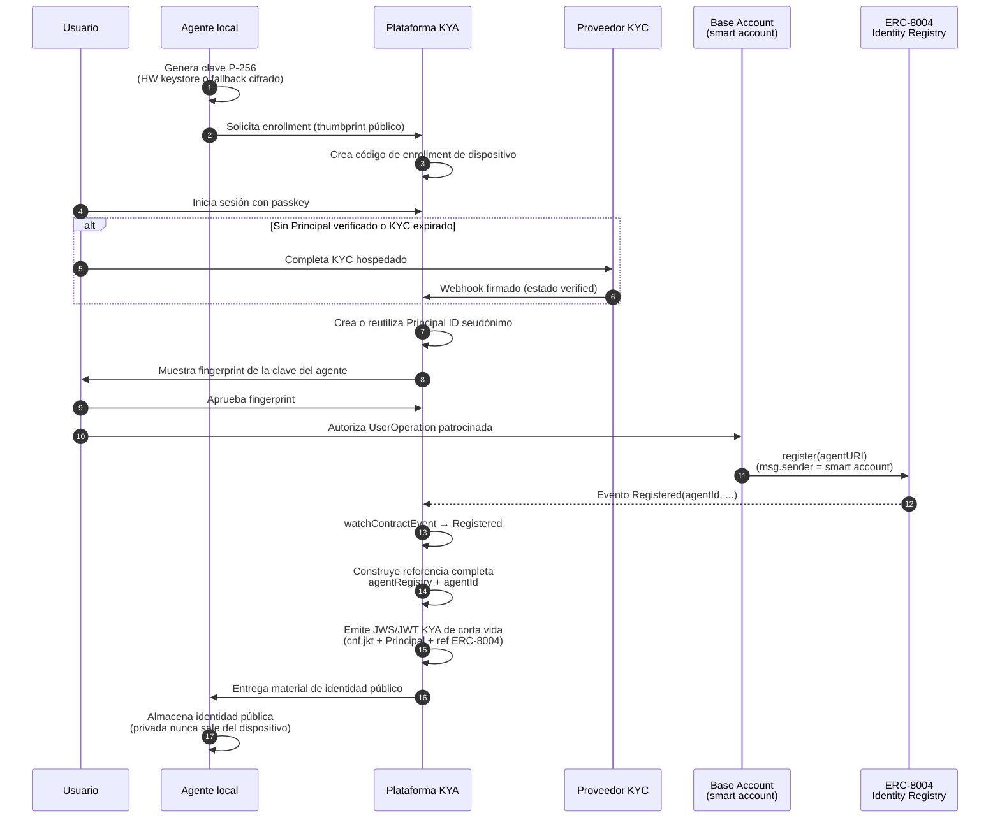

# FLOW — Autenticación de agentes compradores locales (KYA)

## Decisión ejecutiva

**KYC es solo para personas** y, en condiciones normales, **se hace una sola vez**. La persona autoriza uno o más agentes compradores locales que corren en su PC. La plataforma KYA vincula un **Principal ID** seudónimo verificado a un **Agent ID ERC-8004** y a la **clave pública local** del agente.

| En alcance | Fuera de alcance |
| --- | --- |
| Ceremonia de identidad (persona ↔ agente local ↔ KYA) | Flujo comercial del merchant |
| Enrollment, credencial KYA, autenticación del agente | Pagos y liquidación |
| Binding Principal ID + ERC-8004 + clave local | AP2 y cualquier protocolo de pago |
| Consumo del Identity Registry curated | Deploy de registry propio; Hardhat/Foundry en runtime |

**Actores de la ceremonia (4):** Usuario · Agente local · Plataforma KYA · Proveedor KYC.  
ERC-8004 es **infraestructura interna** de Plataforma KYA, no un quinto actor de negocio.

---

## Flujo principal (happy path)

---

## 1. Alcance y no-objetivos

### Alcance
- Autenticar agentes compradores **locales** en el PC del usuario.
- Vincular persona verificada (Principal ID) ↔ Agent ID ERC-8004 ↔ clave pública local.
- Enrollment, rotación, revocación y autenticación challenge-response del agente ante Plataforma KYA.
- Consumir el **Identity Registry curated** ya desplegado y su ABI oficial.

### No-objetivos
- Merchant, checkout, captura de pago, liquidación.
- AP2 u otros protocolos de pago.
- Reputation Registry / Validation Registry de ERC-8004.
- Desplegar un registry ERC-8004 propio (Hardhat/Foundry **no** están en el path de runtime).
- Almacenar documentos KYC, biometría o PII en cadena o en `agentURI`.

---

## 2. Responsabilidades de los actores

| Actor | Responsabilidad | No hace |
| --- | --- | --- |
| **Usuario** | Passkey, KYC (si falta o expiró), aprobación de fingerprint/binding, UserOperation vía Base Account | Operar la clave privada del agente |
| **Agente local** | Generar/usar clave P-256; firmar challenges; guardar identidad pública | Completar KYC; poseer el NFT Agent ID; exponer endpoint público |
| **Plataforma KYA** | Orquestar enrollment, adaptar KYC, hospedar `agentURI`, emitir/revocar JWS KYA, indexar eventos | Ver/autorizar al agente en lugar del usuario; llamar `register` desde su wallet; desplegar registry |
| **Proveedor KYC** | Verificar **solo a la persona**; webhook firmado con estado normalizado | Ver, registrar o autorizar al agente |

---

## 3. Enrutamiento de proveedores KYC

| Rol | Proveedor | Motivo |
| --- | --- | --- |
| Primario MVP | **Didit** | Velocidad de integración y cobertura MVP |
| Primario producción (Colombia) | **Incode** | Validación contra registros gubernamentales |
| Fallback / benchmark global | **Veriff** | Cobertura internacional y referencia de calidad |

**Adapter único** — estados normalizados: `pending` · `verified` · `needs_review` · `rejected` · `expired`.

| Regla | Detalle |
| --- | --- |
| Separación | El proveedor verifica a la persona; **nunca** ve ni autoriza al agente |
| Retener | Refs de sesión/proveedor + metadatos de assurance |
| Prohibido | Documentos crudos, selfies, biometría, plantillas |
| Frecuencia | KYC **normalmente una vez**; un Principal verificado autoriza **varios** agentes |
| Re-KYC | Solo si la persona **no** tiene verificación activa o está `expired` |

---

## 4. Enrollment (camino feliz) — checklist

1. Agente genera clave P-256: **no exportable** si el keystore hardware del SO lo soporta; si no, **fallback** en keystore cifrado del SO. La privada **nunca sale del dispositivo**.
2. Plataforma crea código de enrollment de dispositivo.
3. Usuario inicia sesión con passkey (autorización raíz humana).
4. Si no hay Principal verificado activo o el KYC expiró: KYC hospedado → webhook → `verified`.
5. Plataforma crea o reutiliza **Principal ID** seudónimo.
6. Usuario ve y aprueba el fingerprint de la clave del agente.
7. Smart account (`@base-org/account`) ejecuta `register(agentURI)` con gas patrocinado.
8. Plataforma indexa `Registered` (`viem` `watchContractEvent`) y arma `agentRegistry` + `agentId`.
9. Plataforma emite credencial KYA JWS/JWT de corta vida (ver §6).
10. Agente guarda solo material público; la privada no se transmite nunca.

---

## 5. Herramientas para ERC-8004

### Decisión de producto

| Tema | Decisión MVP | Notas |
| --- | --- | --- |
| Modelo de contratos | **No** deploy custom | Consume Identity Registry curated + ABI oficial |
| Tooling de deploy | Hardhat / Foundry **fuera** del runtime | Solo consumo on-chain vía cliente EVM |
| Registries | Solo **Identity Registry** | Reputation y Validation: fuera de alcance |
| Red MVP | **Base Sepolia** · chain ID **84532** | Pruebas y enrollment |
| IdentityRegistry MVP | `0x8004A818BFB912233c491871b3d84c89A494BD9e` | Curated oficial; **reverificar al integrar** |
| Red producción (plan) | **Base Mainnet** · chain ID **8453** | Promoción con gate de verificación |
| IdentityRegistry prod (plan) | `0x8004A169FB4a3325136EB29fA0ceB6D2e539a432` | Curated oficial; **reverificar al promover** |
| Estado del estándar | ERC-8004 **Draft** | Gate: dirección + versión de contrato |
| ABI oficial | [erc-8004/erc-8004-contracts](https://github.com/erc-8004/erc-8004-contracts) | Fuente de ABI |
| EIP | [EIP-8004](https://eips.ethereum.org/EIPS/eip-8004) | Especificación |
| Cliente EVM TS | **`viem`** | `simulateContract`, `writeContract`, `readContract`, decode, EIP-712, **`watchContractEvent`** (`Registered`, `Transfer`) |
| Smart account | **`@base-org/account`** | Base Account ERC-4337 respaldada por passkey |
| Gas | Paymaster compatible | El smart account (no el relayer) es `owner` del Agent ID |
| RPC | Provider Base de producción | RPC público solo para desarrollo local |
| `agentURI` | HTTPS versionado hospedado por KYA | IPFS = portabilidad posterior |
| Firmas / thumbprints | **`jose`** | ES256/JWS; thumbprint JWK **RFC 7638** (`cnf.jkt`) |
| Clave privada local | HW keystore si existe; si no, keystore cifrado del SO | Nunca transmitir ni exportar fuera del dispositivo |

> **Nota de verificación:** las direcciones se tomaron del repositorio oficial de contratos curated y **deben reverificarse** al integrar/promover. No inventar hashes de deploy ni secretos de API.

### Por qué el relayer no llama `register`

`register` mintea la propiedad a `msg.sender`. Si el relayer llama desde su wallet, `ownerOf(agentId)` apuntaría a la plataforma.

La UserOperation ERC-4337 patrocinada debe ejecutarse desde el **smart account de la persona**, para que `ownerOf(agentId)` resuelva a la cuenta controlada por el usuario.

| Quién ejecuta | `ownerOf` | ¿Válido? |
| --- | --- | --- |
| Smart account del usuario (patrocinado) | Cuenta de la persona | Sí |
| Wallet/relayer de KYA | Wallet de KYA | No |

### Operaciones on-chain (Identity Registry)

| Operación | Uso en KYA |
| --- | --- |
| `register(agentURI)` | Alta del Agent ID; ownership = smart account del usuario |
| `ownerOf(agentId)` | Comprobar ownership actual |
| `tokenURI` / lectura de URI | Resolver metadatos / `agentURI` |
| `setAgentURI` | Actualizar URI versionada (sin PII) |
| `Transfer` (vía `watchContractEvent`) | Suspender binding hasta Principal verificado activo + aprobación explícita; KYC solo si falta o expiró |

### Propósito mínimo de `agentURI` (agente local)

El PC del agente **no** necesita endpoint público entrante: **la plataforma hospeda** el archivo de registro ERC-8004.

| Incluye | Nunca incluye |
| --- | --- |
| Metadatos de registro ERC-8004 requeridos | Principal ID |
| Referencia completa `agentRegistry` + `agentId` (cuando exista) | Proveedor KYC |
| Estado activo del registro | Datos documentales |
| DID o servicio resolutor KYA | Biometría / PII |

---

## 6. Credencial KYA (MVP) y campos canónicos

### Formato MVP — JWS/JWT de corta vida firmado por la plataforma

Bound a la clave pública del agente vía **`cnf.jkt`** (thumbprint JWK RFC 7638). **Sin PII.**

| Claim / campo | Contenido |
| --- | --- |
| `cnf.jkt` | Thumbprint de la clave pública del agente |
| Principal ID | Seudónimo verificado |
| `agentRegistry` + `agentId` | Referencia ERC-8004 completa |
| `iss` | Emisor = Plataforma KYA |
| `aud` | Audience del consumidor previsto |
| `iat` / `exp` | Emisión y expiración (corta vida) |
| Credential ID | Identificador de la credencial |
| Status reference | Puntero/estado (activa, suspendida, revocada, expirada) |

Perfil externo **W3C VC** o **SD-JWT VC** puede añadirse después **sin cambiar** el modelo de binding (Principal + ref ERC-8004 + `cnf.jkt`).

### Campos canónicos de identidad

| Campo | Descripción |
| --- | --- |
| `agent_uuid` | UUID interno de plataforma |
| `agentRegistry` | `eip155:84532:<identityRegistryAddress>` (MVP) o `eip155:8453:...` (prod) |
| `agentId` | ID on-chain (ERC-721 token id) |
| `owner` | Smart account dueño |
| `agentURI` | URI HTTPS del archivo de registro hospedado por KYA |
| `local_key_thumbprint` / `cnf.jkt` | Thumbprint JWK RFC 7638 |
| `principal_id` | Seudónimo de la persona verificada |
| `kya_credential_id` | ID de la credencial |
| `kya_credential_status` | activa / suspendida / revocada / expirada |
| `kya_credential_expiry` | Expiración del JWS/JWT |

**Unicidad:** `agentId` solo **no** es globalmente único. Canónico: **`agentRegistry` + `agentId`**.

---

## 7. Autenticación del agente ante la plataforma

Challenge firmado por la clave operativa local (ES256 vía `jose`):

| Campo | Rol |
| --- | --- |
| `nonce` | Anti-replay |
| `audience` | Destino = Plataforma KYA |
| `timestamp` | Ventana de validez |
| `intent_hash` | Hash del intent firmado |

1. Agente solicita challenge (`agent_uuid` o ref completa + thumbprint).
2. Plataforma emite nonce + audience + ventana temporal.
3. Agente firma con la clave P-256 local (nunca sale del dispositivo).
4. Plataforma verifica firma, `cnf.jkt`, estado de credencial y ownership on-chain.
5. Emite/renueva sesión o JWS operativo de corta vida.

| Tipo de clave | Quién | Vida útil |
| --- | --- | --- |
| Passkey / autorización raíz | Humano | Larga; enrollment y actos sensibles |
| Clave operativa del agente | Agente local | Corta / rotable; challenges autónomos |

Credencial **copiada es inútil** sin la clave privada local.

---

## 8. Rotación, revocación, pérdida de dispositivo y transferencias

| Evento | Comportamiento |
| --- | --- |
| Rotación de clave (mismo PC) | Aprobar nuevo fingerprint; nuevo JWS; revocar el anterior |
| Cambio de PC | Nueva clave + revocar la vieja; **sin KYC** salvo política o expiración |
| Revocación voluntaria | Credencial → `revocada`; agente deja de autenticarse |
| Pérdida de dispositivo | Revocar credencial del thumbprint; enrollar nuevo dispositivo |
| `Transfer` del ERC-721 | **Suspender** binding KYA hasta que el nuevo owner esté ligado a un **Principal ID verificado activo** y **apruebe explícitamente** el binding; ejecutar KYC **solo** si esa persona no está verificada o la verificación expiró; luego emitir nueva credencial |
| Expiración KYC/credencial | No usable hasta renovación (re-KYC solo si el Principal no está `verified`) |

---

## 9. Datos almacenados vs prohibidos

| Almacenar | Prohibido |
| --- | --- |
| Principal ID seudónimo | PII en cadena o en JWS |
| Refs KYC + assurance | Documentos / biometría / selfies |
| `agentRegistry` + `agentId` + `owner` | Evidencia KYC en `agentURI` |
| `cnf.jkt` / thumbprint público | Clave privada del agente |
| JWS KYA (id/status/exp) | Secretos de API en este documento |
| `agentURI` hospedado (sin PII) | Principal ID / proveedor KYC en `agentURI` |

---

## 10. Fases de implementación

| Fase | Entrega |
| --- | --- |
| **F0** | Adapter KYC (Didit) + estados normalizados + passkey login |
| **F1** | Enrollment dispositivo + fingerprint + Principal ID (KYC solo si falta/expiró) |
| **F2** | `viem` + `@base-org/account` + paymaster + `register` contra registry curated (Sepolia) |
| **F3** | `watchContractEvent` (`Registered`/`Transfer`) + JWS KYA (`jose`, `cnf.jkt`) + auth challenge |
| **F4** | Rotación/revocación/device loss + Incode (CO) + Veriff fallback |
| **F5** | Gate dirección/versión → Base Mainnet (sigue sin deploy propio) |

---

## 11. Checklist de aceptación

- [ ] KYC solo verifica personas; normalmente una vez; el proveedor no ve al agente.
- [ ] Un Principal verificado puede autorizar múltiples agentes.
- [ ] P-256: HW no exportable si el SO lo soporta; si no, keystore cifrado; privada nunca sale del dispositivo.
- [ ] Usuario aprueba fingerprint antes del binding.
- [ ] MVP consume Identity Registry curated + ABI oficial; sin deploy propio; Hardhat/Foundry fuera del runtime.
- [ ] `register` vía smart account del usuario (`@base-org/account`, UserOperation patrocinada).
- [ ] `ownerOf(agentId)` = smart account de la persona, no el relayer.
- [ ] Referencia canónica = `agentRegistry` + `agentId`.
- [ ] Credencial MVP = JWS/JWT corta vida con `cnf.jkt`, Principal, ref completa, `iss`/`aud`/`iat`/`exp`, id y status ref; sin PII.
- [ ] `agentURI` hospedado por KYA; sin Principal ID, KYC, documentos ni biometría.
- [ ] Indexación con `viem` `watchContractEvent` para `Registered` y `Transfer`.
- [ ] Auth: nonce + audience + timestamp + intent hash firmado (`jose` ES256).
- [ ] Transfer: suspende hasta Principal verificado activo + aprobación explícita; KYC solo si falta o expiró.
- [ ] Cambio de PC: nueva clave + revocación; KYC solo si política/expiración.
- [ ] Merchant/pagos/AP2 no aparecen en este flujo.
- [ ] Direcciones curated reverificadas antes de integrar/promover.

---

## 12. Decisiones de seguridad (resumen)

1. KYC normalmente una vez; un Principal autoriza muchos agentes.
2. Credencial copiada ≠ acceso: falta la clave local.
3. Separar passkey humana (raíz) de claves operativas del agente.
4. Transfer ERC-721 → suspender binding hasta Principal verificado activo + aprobación explícita; KYC solo si la persona no está verificada o expiró.
5. Nunca PII ni evidencia KYC on-chain, en `agentURI` ni en el JWS.
6. Cambio de PC → nueva clave + revocación; KYC solo si política o expiración.
7. El relayer no es `msg.sender` de `register`.
8. MVP no despliega registry; solo consume el curated.

---

## 13. Referencias autoritativas

| Recurso | URL / valor |
| --- | --- |
| EIP-8004 | https://eips.ethereum.org/EIPS/eip-8004 |
| Contratos / ABI oficiales | https://github.com/erc-8004/erc-8004-contracts |
| IdentityRegistry Base Sepolia (84532) | `0x8004A818BFB912233c491871b3d84c89A494BD9e` |
| IdentityRegistry Base Mainnet (8453) | `0x8004A169FB4a3325136EB29fA0ceB6D2e539a432` |
| Cliente EVM | `viem` (`watchContractEvent`, simulate/write/read, EIP-712) |
| Smart account | `@base-org/account` (Base Account, ERC-4337 + passkey) |
| Firmas / JWS / thumbprints | `jose` (ES256, JWS/JWT, RFC 7638 `jkt`) |
| KYC MVP | Didit |
| KYC prod Colombia | Incode |
| KYC fallback global | Veriff |

---

*Documento autocontenido de arquitectura de autenticación. Merchant, pagos y AP2 están explícitamente fuera de alcance.*
