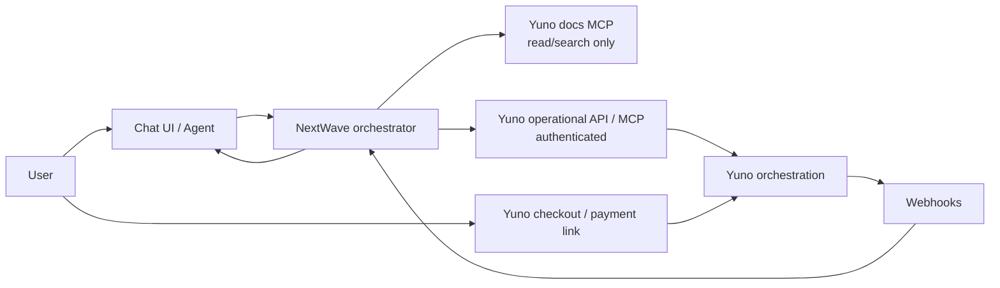

# NextWave

**Chat to pay.** An AI commerce agent that creates Yuno customers and
checkouts, watches payment status, and explains outcomes — so buyers complete
payments in conversation instead of hunting for a checkout page.

> **Status:** concept / bootstrap. This repository documents the hackathon MVP
> intent. No runtime, agent, or Yuno integration is implemented yet.

---

## Problem

Buying online still forces users out of the conversation: find a product, open
a checkout, enter details, then come back later to ask “did it go through?”
Agents that can talk about payments but cannot safely orchestrate them leave
the hardest part to the user.

## Proposed solution

NextWave is an AI-powered commerce/payment agent with **Yuno as the payment
orchestration layer**. The agent:

1. Understands purchase intent in chat
2. Creates or retrieves a Yuno customer
3. Creates a Yuno checkout session or payment link
4. Observes payment lifecycle via Yuno webhooks
5. Explains status in plain language
6. Initiates refunds/cancellations **only after explicit user confirmation**

### Two Yuno MCP surfaces (do not conflate)

| Surface | Purpose | Auth | Allowed use |
| --- | --- | --- | --- |
| **Public documentation MCP** | Read/search Yuno docs for agents and developers | Docs access only | Discovery, coding assistance, accurate explanations |
| **Authenticated operational Yuno MCP / API** | Real account actions (customers, checkouts, payments, refunds) | Sandbox/production credentials | Runtime money-moving flows in this app |

Documentation MCP **never** creates payments. Operational MCP/API **never**
replaces docs search — it mutates a real Yuno account.

---

## End-to-end user flow

```text
User chat → Agent resolves intent
         → Create/retrieve Yuno customer
         → Create checkout session or payment link
         → User pays in Yuno (sandbox or live)
         → Webhook updates payment status
         → Agent explains status
         → (Optional) User confirms refund/cancel → Agent calls Yuno
```

<details>
<summary>Step detail</summary>

1. **Chat** — User asks to buy, pay, check status, or reverse a payment.
2. **Customer** — Agent creates a Yuno customer or retrieves by external ID.
3. **Checkout** — Agent creates a checkout session and/or payment link and
   returns the pay URL/session to the user.
4. **Pay** — User completes payment through Yuno-hosted or SDK checkout.
5. **Observe** — App webhook receiver verifies authenticity and stores status
   transitions.
6. **Explain** — Agent answers “what happened?” from observed state, not
   guesses.
7. **Reverse (gated)** — Refund or cancel only after an explicit confirmation
   turn; never inferred from casual chat.

</details>

---

## MVP scope

### In scope

- Conversational agent that drives the flow above
- Yuno customer create/retrieve
- Checkout session and/or payment link creation
- Webhook ingestion + status explanation
- Explicit-confirmation gate for refund/cancel
- Sandbox-first demo path

### Out of scope (for this MVP)

- Production go-live / live money without review
- Full catalog, inventory, or ERP
- Autonomous refunds without confirmation
- Multi-merchant marketplace settlement

---

## Architecture



<details>
<summary>Component notes</summary>

- **Chat UI / Agent** — Natural-language interface; never holds raw card data
  when using Yuno checkout/links.
- **Orchestrator** — Owns session state, tool policy, confirmation gates, and
  webhook → chat correlation.
- **Docs MCP** — Grounds answers in official docs; no account side effects.
- **Operational API/MCP** — Customers, checkout sessions, payments, refunds,
  cancels against sandbox (default) or production.
- **Webhooks** — Source of truth for payment status after the user leaves the
  chat to pay.

</details>

---

## Yuno capabilities used

| Capability | Role in NextWave |
| --- | --- |
| Customers | Create / retrieve buyer identity for checkout |
| Checkout sessions | Initialize payable sessions for SDK or hosted flow |
| Payment links | Shareable pay URL when chat should hand off |
| Payments | Capture purchase outcome after checkout |
| Webhooks | Async status (purchase, authorize, refund, cancel, …) |
| Refunds / cancels | Reversal paths, always confirmation-gated in the agent |

---

## Safety boundaries (money-moving actions)

- Prefer **Yuno sandbox** for all local and demo work.
- **Read vs write:** status explanation is read-only; create checkout / refund /
  cancel are writes.
- **Explicit confirmation** required before refund or cancel; paraphrase amount
  and payment ID first.
- **No credentials in git** — use env placeholders only (see below).
- **Webhook authenticity** — verify signatures/HMAC (or configured auth) before
  trusting status.
- **Docs MCP ≠ ops MCP** — documentation tools must not be wired to account
  credentials.
- Idempotency and audit logging planned for every write to Yuno.

---

## Planned stack

| Layer | Direction (subject to change) |
| --- | --- |
| Agent / orchestration | LLM agent + tool policy (confirmation gates) |
| App runtime | TypeScript (Node) API + lightweight chat UI |
| Payments | Yuno sandbox API + webhooks |
| Docs grounding | Yuno public documentation MCP |
| Ops actions | Authenticated Yuno API and/or remote operational MCP |
| Config | Environment variables; no secrets in repository |

---

## Local development (placeholders)

### Prerequisites (planned)

- Node.js LTS
- Package manager (`pnpm` / `npm` / `yarn` — TBD)
- Yuno **sandbox** account + API credentials
- Public URL for webhooks (e.g. tunnel) during local demos

### Environment variables (names only — never commit real values)

```bash
# Example .env — replace secrets with sandbox values from the Yuno dashboard
# Required for local / operational MCP (Agent Toolkit, yuno-mcp, Remote MCP)
YUNO_PUBLIC_API_KEY=your_sandbox_public_api_key
YUNO_PRIVATE_SECRET_KEY=your_sandbox_private_secret_key
YUNO_ACCOUNT_CODE=your_sandbox_account_code
# Optional defaults for local operational MCP checkout/payment tools
YUNO_COUNTRY_CODE=your_country_code
YUNO_CURRENCY=your_currency
# App / API helpers (not MCP auth headers)
YUNO_WEBHOOK_SECRET=your_webhook_hmac_or_shared_secret
YUNO_API_BASE_URL=https://api-sandbox.y.uno
# Public MCP endpoints (non-secret URLs from Yuno docs)
YUNO_DOCS_MCP_URL=https://docs.y.uno/mcp
YUNO_OPS_MCP_URL=https://mcp.prod.y.uno/mcp
```

### Setup (to be filled when code lands)

```bash
git clone https://github.com/ram4-dev/nextwave_hackathon.git
cd nextwave_hackathon
# install dependencies — TBD
# copy env template — TBD
# run app + webhook receiver — TBD
```

Use
[Yuno sandbox / environments](https://docs.y.uno/reference/getting-started/api-environments)
and the
[testing gateway](https://docs.y.uno/docs/direct-integration-use-cases/yuno-testing-gateway)
for safe demos.

---

## Sandbox demo scenario

1. Start chat: “I want to buy the demo item for $10.”
2. Agent creates/retrieves a sandbox customer and a checkout or payment link.
3. Open the link; pay with a
   [Yuno test card / testing gateway](https://docs.y.uno/docs/direct-integration-use-cases/yuno-testing-gateway).
4. Webhook marks payment succeeded; ask the agent: “Did my payment go through?”
5. Ask for a refund; agent restates amount/ID and **waits for explicit
   “yes, refund it.”**
6. After confirmation, agent calls refund; webhook + agent confirm the new
   status.

---

## Roadmap

| Phase | Focus |
| --- | --- |
| **0 — Bootstrap** | Repo, README, concept boundaries *(current)* |
| **1 — Skeleton** | Chat shell, config, sandbox client stubs |
| **2 — Pay path** | Customer + checkout/payment link + webhook receiver |
| **3 — Agent tools** | Status explain + confirmation-gated refund/cancel |
| **4 — Demo polish** | Scripted sandbox journey, failure/timeout messaging |
| **5 — Hardening** | Audit trail, idempotency, clearer MCP separation in code |

---

## Official Yuno documentation

- [Developer resources](https://docs.y.uno/docs/developers) —
  API, webhooks, SDKs, MCP, credentials
- [Payment flow](https://docs.y.uno/docs/how-yuno-works/how-yuno-payment-flow-works) —
  customer → session → payment
- [Customers](https://docs.y.uno/docs/basic-concepts/customers)
- [Create checkout session](https://docs.y.uno/reference/checkout-sessions/create-checkout-session)
- [Payment links (dashboard)](https://docs.y.uno/docs/using-yuno/dashboard-overview/payment-links)
- [Webhooks](https://docs.y.uno/docs/webhooks) ·
  [Configure](https://docs.y.uno/docs/webhooks/configure-webhooks) ·
  [HMAC verify](https://docs.y.uno/docs/webhooks/verify-webhook-signatures-hmac)
- [Refund payments](https://docs.y.uno/docs/direct-integration-use-cases/refund-payments) ·
  [Cancel payments](https://docs.y.uno/docs/direct-integration-use-cases/cancel-payments)
- [API environments (sandbox)](https://docs.y.uno/reference/getting-started/api-environments)
- [Documentation MCP](https://docs.y.uno/setup-mcp) —
  connect agents to Yuno docs (read/search)
- [Remote Yuno MCP server](https://docs.y.uno/docs/ai-capabilities/remote-yuno-mcp-server) —
  authenticated operational MCP
- [Building AI integrations with LLMs & MCP](https://docs.y.uno/docs/ai-capabilities/building-ai-integrations-with-yunos-llms-and-mcp)

---

## License

TBD for the hackathon submission.
