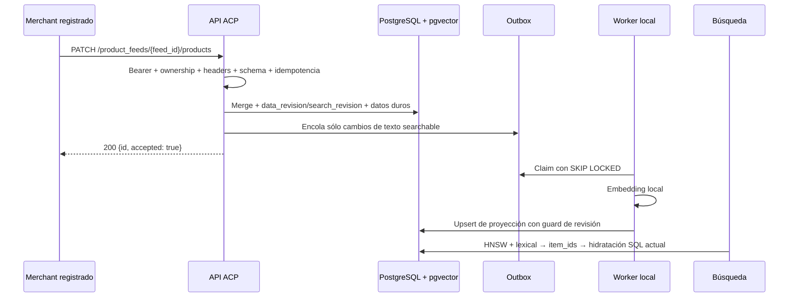

# Arquitectura objetivo — ingesta de catálogo de merchants mediante ACP

> **Estado: implementada en este worktree.** El runtime acepta feeds ACP
> current-state; la fixture Juno queda como seed/test. Rollback: pausar rutas y
> worker con `CATALOG_ACP_ENABLED=false` y `CATALOG_WORKER_ENABLED=false`.

Los merchants registrados serán la fuente de productos, precio y stock. Harán
push mediante las superficies de Feeds y Products de ACP. La búsqueda mantiene
PostgreSQL/pgvector, HNSW, fallback exacto, ranking híbrido y una única
hidratación SQL. El MVP acepta sólo feeds de Argentina, contenido en español y
precios ARS.

## Flujo principal

## Qué se mantiene y qué cambia

| Se mantiene | Cambia |
|---|---|
| Un único PostgreSQL con pgvector | Juno deja de ser fuente runtime |
| Proyección mínima y datos duros separados | Snapshots globales pasan a estado actual por feed |
| HNSW principal y fallback exacto por readiness | Cada PATCH actualiza sólo los items incluidos |
| Filtros y precio/stock desde SQL | Embeddings se actualizan mediante outbox/worker |
| `POST /v1/catalog/search` público | Se agregan superficies ACP autenticadas para merchants |

## Contrato ACP adoptado

- `POST /product_feeds` crea un feed y `GET /product_feeds/{feed_id}` recupera
  sus metadatos. POST responde `200` según ACP.
- `PATCH /product_feeds/{feed_id}/products` hace upsert parcial por `Product.id`;
  productos omitidos permanecen sin cambios.
- `GET /product_feeds/{feed_id}/products` devuelve el array actual completo;
  ACP no define paginación y el volumen inicial es de 10 ofertas.
- Cada `Variant.id` se normaliza como item vendible con identidad interna
  `(feed_id, product_id, variant_id)`.
- El boundary procesa `Authorization`, `Idempotency-Key`, `Request-Id`,
  `Timestamp`, `API-Version`, `Content-Type`, `Accept-Language` y `User-Agent`.
- El feed exige `target_country=AR`; price/list/unit price usan `ARS` y
  `Accept-Language: es-AR` localiza mensajes. El contenido searchable es español.

## Autenticación del merchant en el MVP

El bearer se resuelve mediante `MerchantFeedAuthorizer`, separado de KYA. Para
el MVP, el equipo da de alta cada merchant manualmente y le entrega una API key
opaca de alta entropía. El valor completo se muestra una sola vez: PostgreSQL
guarda únicamente un identificador/prefijo no secreto, su hash, estado y
`merchant_id`. No habrá login, portal, OAuth ni KYC de merchants en esta etapa.

El backend del merchant envía la key como `Authorization: Bearer <api_key>`.
El authorizer valida la key activa y deriva de ella el `merchant_id`; luego
comprueba que el feed pertenece a ese merchant. El ownership nunca se acepta
desde `seller` u otro campo del body. Una key ausente, desconocida o revocada
responde `401`; un feed ajeno no revela su existencia y responde `404`. La key
cruda nunca se persiste ni se incluye en logs. La rotación y revocación son
operaciones administrativas manuales del MVP (`npm run catalog:revoke` y
`npm run catalog:rotate`); sólo persisten hash, prefijo y estado. El techo
opcional `CATALOG_ACP_RATE_LIMIT` limita mutaciones ACP por merchant en el
proceso.

## Consistencia e indexación

La transacción fusiona campos presentes, conserva los ausentes, incrementa
`data_revision` siempre y `search_revision` sólo ante texto searchable, guarda
precio/stock y registra el receipt idempotente.
Reutilizar una key con el mismo request devuelve el resultado previo; reutilizarla
con otro body se rechaza.

Precio y disponibilidad quedan vigentes al commit, sin esperar embeddings. Si
cambia nombre, descripción, categorías u opciones, la misma transacción agrega
un evento a la outbox. El worker calcula el embedding local y sólo publica si la
revisión sigue siendo la más nueva. PostgreSQL actualiza HNSW automáticamente.

- Item nuevo: aparece en búsqueda después de su primera indexación.
- Item existente: conserva temporalmente el último documento; la respuesta y los
  filtros usan siempre los datos duros actuales.
- `discontinued` o `available=false`: se oculta inmediatamente y queda tombstone.
- URL y media: se aceptan en el estado relacional, pero no entran al vector ni a
  la respuesta de búsqueda del MVP.

Cada resultado expondrá `data_revision`, `search_revision` e `index_revision` y
eliminará `catalog_version`. Así un cambio comercial puede quedar
`data > search = index` sin lag; un cambio textual pendiente queda
`data = search > index`. Un fallo de embedding no revierte precio o stock: el
evento reintenta y después pasa a dead-letter.

## Modelo de datos objetivo

| Tabla | Responsabilidad |
|---|---|
| `catalog_merchants_current` | Merchant habilitado y sus metadatos operativos |
| `catalog_product_feeds` | Feed, merchant propietario y revisiones |
| `catalog_merchant_api_keys` | Prefijo, hash, estado y merchant de cada API key |
| `catalog_products_current` | Producto ACP actual y metadatos no vectoriales |
| `catalog_variants_current` | Item vendible, precio, moneda y disponibilidad |
| `catalog_ingest_receipts` | Idempotency key, hash y respuesta aceptada |
| `catalog_reindex_outbox` | Trabajos, lease, intentos y dead-letter |
| `catalog_search_documents_current` | Texto, embedding y revisión indexada |

La migración será aditiva: backfill de las 10 ofertas como un merchant/feed
sintético, comparación de resultados, activación del worker y cutover de lectura.
Las tablas versionadas actuales se conservan durante el rollback y la fixture
queda únicamente como seed/test.

## Decisiones cerradas

Variant es la unidad vendible; el documento anterior se conserva durante
`index_pending`; sólo bajas explícitas crean tombstone; URL/media quedan
relacionales. No hay versión global. Defaults: 1 MiB, 100 productos, 100
variants por producto y `Timestamp` de cinco minutos.

## Fuentes oficiales

- [ACP API overview](https://developers.openai.com/commerce/specs/api/overview)
- [ACP Feeds](https://developers.openai.com/commerce/specs/api/feeds)
- [ACP Products](https://developers.openai.com/commerce/specs/api/products)

Los artefactos SDD revisables están en
`openspec/changes/add-acp-merchant-catalog-ingestion/`.
