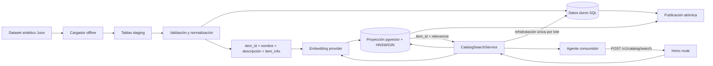

# Spec técnica — Catálogo de merchants Juno y búsqueda

> **Baseline implementada.** Este documento describe el mock offline que existe
> en el worktree. La arquitectura objetivo ya no considera a Juno como fuente de
> catálogo: los merchants registrados harán ingesta incremental mediante ACP.
> Ese cambio está especificado en
> [`ACP_MERCHANT_CATALOG_INGESTION.md`](./ACP_MERCHANT_CATALOG_INGESTION.md).
> Ese cambio ya está implementado: la fixture de este documento queda como
> seed/test y la búsqueda runtime lee estado actual.

## Estado y resultado

**Estado:** implementado en este worktree. HNSW es el camino principal y la
búsqueda exacta es el fallback obligatorio. El modelo de embeddings, el cliente
PostgreSQL y el provisioning quedan resueltos abajo.

Este slice crea una base PostgreSQL con datos sintéticos de merchants y productos
que aceptan Juno, publica índices de búsqueda derivados y expone una única ruta:
`POST /v1/catalog/search`. La ruta recibe lenguaje natural como `papas fritas`,
aplica filtros estructurados y devuelve productos rankeados con merchant, precio,
moneda, disponibilidad y versión de catálogo.

**No hay KYC, login, sesión ni autorización en este slice.** La autenticación se
añadirá después como middleware delante de la ruta, sin entrar en el servicio de
búsqueda ni cambiar sus contratos internos.

## Decisiones

| Tema | Decisión |
| --- | --- |
| Base de datos | PostgreSQL 16 + `pgvector 0.8.1` vía `docker-compose.catalog.yml` (`pgvector/pgvector:0.8.1-pg16`; satisfies `pgvector >= 0.8`) |
| Fuente MVP | Dataset sintético Juno cargado por proceso offline; no API Juno real |
| Unidad indexada | Un producto vendible de un merchant |
| Fuente de verdad | Tablas relacionales versionadas |
| Proyección de búsqueda | `item_id`, nombre, descripción, `item_info` y embedding; sin datos duros |
| Rehidratación | Una consulta SQL por lote para todos los `item_id` candidatos de la misma versión |
| Búsqueda semántica primaria | Embedding + HNSW con distancia coseno |
| Fallback vectorial | Búsqueda exacta controlada si HNSW no está disponible; también sirve como baseline de recall |
| Búsqueda lexical | `tsvector` + índice GIN como complemento |
| Filtros exactos | Se aplican sobre filas relacionales autoritativas, no sobre metadata vectorial duplicada |
| Ranking | Fusión determinística de ranking semántico y lexical |
| API pública | Solo `POST /v1/catalog/search` |
| Auth/KYC | Diferido; la ruta no usa `requireSession`, Principal ID ni credencial KYA |
| Pagos | Fuera de alcance; buscar nunca crea órdenes ni mueve dinero |

## Alcance

### Incluido

- Esquema relacional de versiones, merchants, productos y documentos de búsqueda.
- Datos mock reproducibles para desarrollo y tests.
- Carga offline idempotente con publicación atómica de catálogo.
- Embeddings generados fuera de la escritura HTTP.
- Índices HNSW, GIN, B-tree y constraints de unicidad/integridad.
- Un endpoint de búsqueda semántica con filtros exactos.
- Respuestas versionadas y trazables al snapshot publicado.
- Tests unitarios, de repositorio y del endpoint cuando se implemente.

### Fuera de alcance

- KYC, SIWE, sesiones, API keys, credenciales KYA y autorización.
- Conexión con la API real de Juno.
- Endpoints HTTP para listar, crear o modificar merchants/productos.
- Checkout, órdenes, reserva de stock, pagos o liquidación.
- Panel administrativo o UI de catálogo.
- Sincronización en tiempo real dentro del request de búsqueda.

## Arquitectura



### Límites de componentes

| Componente | Responsabilidad | No hace |
| --- | --- | --- |
| `CatalogLoader` | Lee fixture/feed mock, valida, normaliza y crea una versión candidata | Atender requests HTTP |
| `EmbeddingProvider` | Convierte texto en un vector del modelo configurado | Conocer merchants, precios o auth |
| `CatalogRepository` | Recupera IDs rankeados y rehidrata datos duros en lote dentro de la misma versión | Generar texto, hacer N+1 o inventar datos |
| `CatalogSearchService` | Valida invariantes de búsqueda, obtiene embedding y compone respuesta | Leer KYC o verificar sesiones |
| Hono route | Valida JSON, llama al servicio y mapea errores HTTP | Implementar SQL o ranking |

El servicio de catálogo debe vivir separado del `Repository`/`KyaStore` actual.
No se agregan merchants o embeddings al archivo JSON de identidad y no se acopla
el ciclo de vida del catálogo al de principals, enrollments o credenciales.

## Modelo de datos

### `catalog_versions`

Representa una carga completa y controla qué versión puede leer el endpoint.

| Campo | Tipo | Regla |
| --- | --- | --- |
| `id` | `uuid` | PK |
| `source` | `text` | MVP fijo: `juno_mock` |
| `version` | `text` | Identificador estable del dataset; unique por source |
| `status` | enum | `building`, `published`, `superseded`, `failed` |
| `embedding_model` | `text` | Modelo usado para todos los documentos de la versión |
| `embedding_dimensions` | `integer` | Debe coincidir con la columna vectorial desplegada |
| `source_updated_at` | `timestamptz` | Frescura declarada por el dataset |
| `created_at` | `timestamptz` | Default `now()` |
| `published_at` | `timestamptz` nullable | Solo cuando `status = published` |

Debe existir como máximo una versión `published`. La publicación cambia la
versión anterior a `superseded` y activa la nueva dentro de una sola transacción.

### `catalog_merchants`

Una fila por merchant y versión.

| Campo | Tipo | Regla |
| --- | --- | --- |
| `catalog_version_id` | `uuid` | FK a `catalog_versions` |
| `merchant_id` | `text` | ID estable proveniente del mock |
| `name` | `text` | No vacío |
| `slug` | `text` | Normalizado, no usado como identidad |
| `category` | `text` | Slug normalizado |
| `country_code` | `text` | Dos letras mayúsculas |
| `locality` | `text` nullable | Ciudad/localidad |
| `accepts_juno` | `boolean` | Debe ser `true` en este dataset |
| `source_updated_at` | `timestamptz` | Frescura del registro |

PK compuesta: (`catalog_version_id`, `merchant_id`).

### `catalog_products`

Una fila representa un producto vendible por un merchant. En este slice no se
intenta deduplicar un producto canónico entre merchants diferentes.

| Campo | Tipo | Regla |
| --- | --- | --- |
| `catalog_version_id` | `uuid` | Parte de PK y FK |
| `item_id` | `text` | ID estable del producto vendible y único dentro de la fuente |
| `merchant_id` | `text` | FK compuesta a `catalog_merchants` |
| `name` | `text` | No vacío |
| `description` | `text` | Default vacío |
| `category` | `text` | Slug normalizado |
| `tags` | `text[]` | Default `{}` |
| `price_minor` | `bigint` | Entero entre 0 y `Number.MAX_SAFE_INTEGER`; nunca usar float para dinero |
| `currency` | `text` | Tres letras mayúsculas |
| `availability` | enum | `in_stock`, `out_of_stock`, `unknown` |
| `source_updated_at` | `timestamptz` | Frescura de precio/stock |

PK compuesta: (`catalog_version_id`, `item_id`). La FK de merchant incluye
`catalog_version_id` para impedir referencias cruzadas entre snapshots.

### `catalog_search_documents`

Tabla derivada, una fila por `catalog_products`. Es una proyección mínima para
descubrimiento semántico y lexical; no duplica datos duros del catálogo.

| Campo | Tipo | Regla |
| --- | --- | --- |
| `catalog_version_id` | `uuid` | Parte de PK/FK |
| `item_id` | `text` | Parte de PK/FK a la fila relacional de la misma versión |
| `name` | `text` | Nombre en español usado para búsqueda y presentación |
| `description` | `text` | Descripción en español usada para búsqueda y presentación |
| `item_info` | `text` | Contexto textual normalizado del item, sin precio, stock ni merchant autoritativo |
| `search_text` | `text` | Documento canónico normalizado |
| `search_tsv` | `tsvector` | Generated/stored desde `search_text` con config `simple` |
| `embedding` | `vector(384)` | Fijado a `Xenova/paraphrase-multilingual-MiniLM-L12-v2` (o el proveedor inyectado en tests) |
| `is_published` | `boolean` | Solo la versión activa usa `true` |

`search_text` concatena, en orden estable, `name`, `description` e `item_info`.
Precio, moneda, disponibilidad y datos del merchant no se almacenan aquí ni se
infieren desde el embedding. `catalog_version_id` e `item_id` enlazan ambas
responsabilidades sin convertir pgvector en una base separada.

## Índices requeridos

```sql
CREATE EXTENSION IF NOT EXISTS vector;

CREATE UNIQUE INDEX catalog_one_published_version
  ON catalog_versions ((status))
  WHERE status = 'published';

CREATE UNIQUE INDEX catalog_merchants_source_id
  ON catalog_merchants (catalog_version_id, merchant_id);

CREATE UNIQUE INDEX catalog_products_source_id
  ON catalog_products (catalog_version_id, item_id);

CREATE INDEX catalog_search_embedding_hnsw
  ON catalog_search_documents
  USING hnsw (embedding vector_cosine_ops)
  WHERE is_published = true;

CREATE INDEX catalog_search_lexical_gin
  ON catalog_search_documents
  USING gin (search_tsv)
  WHERE is_published = true;

CREATE INDEX catalog_items_merchant
  ON catalog_products (catalog_version_id, merchant_id);

CREATE INDEX catalog_items_category
  ON catalog_products (catalog_version_id, category);

CREATE INDEX catalog_items_price_availability
  ON catalog_products (catalog_version_id, currency, price_minor, availability);
```

PostgreSQL mantiene HNSW, GIN y B-tree cuando las filas se insertan, actualizan o
eliminan. Eso no genera embeddings: el pipeline crea el vector y escribe la
proyección; PostgreSQL actualiza el índice a partir de esa escritura. No se
agrega un índice GIN genérico sobre JSON. La implementación debe verificar planes
con `EXPLAIN (ANALYZE, BUFFERS)` sobre un dataset representativo.

### Decisión: HNSW principal con fallback exacto

El objetivo no es únicamente encontrar resultados en un fixture pequeño, sino
simular el comportamiento de un índice vectorial real: construcción del grafo,
búsqueda aproximada, interacción con filtros, recall y tuning. Por eso HNSW es
parte obligatoria del path de producción del endpoint desde la primera versión.

La búsqueda vectorial exacta cumple dos funciones: oráculo de comparación en
tests/benchmarks y fallback operativo cuando HNSW no puede atender la consulta.
El fallback conserva el mismo ranking lexical y la misma rehidratación y
aplicación de filtros sobre datos relacionales.

La degradación debe ser explícita: el repository devuelve el modo utilizado, la
respuesta incluye `search_mode: "exact_fallback"` y se registra la razón. No se
debe depender de que el planner cambie silenciosamente a un sequential scan. Un
probe de readiness determina si el índice esperado está disponible antes de
seleccionar HNSW. Solo un resultado explícito `unavailable` del probe activa el
fallback; los errores de consulta, conexión o transacción nunca lo activan. Si
el fallback ya fue seleccionado y su consulta exacta falla, la respuesta es el
`503 SEARCH_UNAVAILABLE` sanitizado, no un `500` ni un segundo fallback.

Si fallan tanto HNSW como la búsqueda exacta, el endpoint devuelve
`SEARCH_UNAVAILABLE`.

## Carga offline y publicación

1. Crear `catalog_versions(status = building)` con `version` idempotente.
2. Cargar el fixture a tablas staging mediante lotes.
3. Rechazar IDs duplicados, precios negativos, monedas inválidas, merchants sin
   Juno o productos huérfanos.
4. Construir por item el payload `item_id`, `name`, `description` e `item_info`.
5. Generar en lotes el embedding de ese payload con un `EmbeddingProvider`.
6. Verificar que modelo y dimensiones sean iguales para toda la versión.
7. Insertar catálogo y documentos con `is_published = false`.
8. En una transacción: marcar la versión anterior como `superseded`, cambiar sus
   documentos a `is_published = false`, activar los nuevos y marcar la versión
   candidata como `published`.
9. Conservar una versión anterior para rollback y purgar versiones más antiguas
   fuera de la transacción de publicación.

Si cualquier paso falla, la versión permanece `failed` o `building`; el endpoint
continúa leyendo la última versión publicada. Repetir la misma `version` no debe
duplicar merchants, productos ni documentos.

## Contrato HTTP

### `POST /v1/catalog/search`

Endpoint público para este slice. No requiere `Authorization` ni consulta estado
de identidad. El futuro middleware de auth podrá envolver esta ruta sin cambiar
el request, la respuesta o `CatalogSearchService`.

#### Request

```json
{
  "query": "papas fritas",
  "top_k": 10,
  "filters": {
    "merchant_ids": ["merchant_001"],
    "categories": ["comida-rapida"],
    "currency": "ARS",
    "min_price_minor": 1000,
    "max_price_minor": 10000,
    "availability": "in_stock"
  }
}
```

| Campo | Regla |
| --- | --- |
| `query` | Requerido; trim; 2–200 caracteres |
| `top_k` | Opcional; default 10; entero 1–50 |
| `merchant_ids` | Opcional; máximo 50 IDs |
| `categories` | Opcional; máximo 20 slugs |
| `currency` | Opcional; tres letras mayúsculas |
| `min_price_minor` / `max_price_minor` | Opcionales; enteros >= 0; min <= max |
| `availability` | Opcional; default `in_stock` |

Campos desconocidos se rechazan para detectar errores del cliente temprano.

#### Response `200`

```json
{
  "query": "papas fritas",
  "catalog_version": "juno-mock-2026-08-29-001",
  "as_of": "2026-08-29T21:00:00.000Z",
  "search_mode": "hnsw",
  "results": [
    {
      "item_id": "item_123",
      "merchant": {
        "merchant_id": "merchant_001",
        "name": "Mercado Centro",
        "category": "supermercado",
        "accepts_juno": true
      },
      "product": {
        "name": "Papas clásicas",
        "description": "Papas fritas crocantes",
        "category": "comida-rapida",
        "tags": ["papas", "fritas"]
      },
      "price": {
        "amount_minor": 4500,
        "currency": "ARS"
      },
      "availability": "in_stock",
      "score": 0.91,
      "updated_at": "2026-08-29T20:45:00.000Z"
    }
  ]
}
```

Una búsqueda válida sin coincidencias devuelve `200` con `results: []`. El API
no expone embeddings, distancia cruda, SQL ni configuración del proveedor.

`search_mode` siempre está presente:

| Valor | Significado |
| --- | --- |
| `hnsw` | Camino primario atendido por el índice aproximado |
| `exact_fallback` | HNSW no estaba disponible y se ejecutó comparación exacta |

#### Errores

| HTTP | `code` | Uso |
| --- | --- | --- |
| 400 | `INVALID_SEARCH_REQUEST` | JSON/campos/filtros inválidos |
| 503 | `CATALOG_UNAVAILABLE` | No existe versión publicada |
| 503 | `EMBEDDING_UNAVAILABLE` | No se pudo vectorizar la query |
| 503 | `SEARCH_UNAVAILABLE` | Fallaron HNSW y el fallback exacto |
| 500 | `INTERNAL_ERROR` | Falla inesperada, sin filtrar detalles |

No se definen respuestas `401` o `403` en este slice.

## Lógica de búsqueda

1. Validar el body con un schema estricto.
2. Leer la versión `published` y su `embedding_model`.
3. Generar un embedding de la query con el mismo modelo/dimensión.
4. Iniciar una transacción `REPEATABLE READ READ ONLY`, comprobar readiness de
   HNSW e intentar recuperar hasta
   `candidate_k = min(max(top_k * 10, 50), 200)` candidatos semánticos mediante
   el índice. La subconsulta interna ordena sólo por
   `embedding <=> query_embedding` y limita candidatos para permitir HNSW; la
   consulta exterior aplica `catalog_version_id` y el desempate
   `distance, item_id` de forma determinística.
5. Solo si el probe de readiness marca HNSW como no disponible, ejecutar la
   búsqueda vectorial exacta con el mismo `candidate_k`; marcar
   `search_mode = exact_fallback`.
6. Recuperar hasta `candidate_k` candidatos lexicales usando
   `plainto_tsquery('simple', query)` y `ts_rank_cd`.
7. Fusionar ambos rankings por `item_id` con Reciprocal Rank Fusion ponderado:

```text
score = 61 * (
  0.8 / (60 + semantic_rank) +
  0.2 / (60 + lexical_rank)
)
```

Un candidato ausente en uno de los rankings aporta `0` en ese componente. El
resultado se ordena provisionalmente por `score DESC, item_id ASC`.

8. Rehidratar todos los candidatos mediante una única consulta SQL por lote,
   fijada a la misma `catalog_version`; nunca ejecutar una consulta por item.
9. Aplicar filtros exactos sobre esas filas autoritativas, conservar el orden de
   relevancia y limitar a `top_k`. Un ID ausente o de otra versión invalida toda
   la búsqueda con `503 SEARCH_UNAVAILABLE`; no hay resultados parciales.
10. Responder con `catalog_version`, `search_mode` y la frescura mínima relevante.

La implementación debe habilitar scan iterativo estricto de HNSW por transacción
cuando existan filtros selectivos y medir recall contra búsqueda exacta en tests.

## Embeddings

La spec no selecciona un proveedor externo ni autoriza nuevas credenciales.
Antes de la migración inicial se debe decidir y fijar un único modelo y dimensión
`D` para el despliegue. El contrato interno mínimo es:

```ts
interface EmbeddingProvider {
  readonly model: string;
  readonly dimensions: number;
  embed(texts: readonly string[]): Promise<readonly number[][]>;
}
```

El cargador y el endpoint usan la misma interfaz. Un cambio de modelo o dimensión
requiere construir y publicar una versión completa nueva; nunca mezclar vectores
de modelos diferentes dentro de una versión.

## Organización prevista de módulos

Esta estructura es orientativa y mantiene las dependencias laterales fuera del
core KYA:

```text
src/catalog/
  domain.ts
  schema.ts
  embedding.ts
  repository.ts
  search.ts
  loader.ts
src/server/
  catalog-routes.ts
migrations/
  <version>_catalog.sql
fixtures/juno/
  catalog.json
tests/catalog/
```

`createApp` debe recibir el servicio de catálogo como dependencia o montar un
router dedicado. No debe importar un cliente concreto de embeddings dentro del
handler.

## Verificación requerida al implementar

### Comportamiento

- [x] `papas fritas` encuentra productos equivalentes aunque el nombre no sea idéntico.
- [x] Los filtros nunca devuelven otra moneda, merchant, categoría o rango de precio.
- [x] La proyección contiene solo `item_id`, nombre, descripción, `item_info` y embedding.
- [x] Precio, moneda, merchant y stock se recuperan en un único lote desde `catalog_products`.
- [x] Texto conflictivo nunca reemplaza un dato duro y un item huérfano produce `SEARCH_UNAVAILABLE` sin parciales.
- [x] Un catálogo sin publicar devuelve `CATALOG_UNAVAILABLE`.
- [x] Una query válida sin resultados devuelve `200` y una lista vacía.
- [x] La ruta funciona sin header `Authorization` y no lee tablas KYA.
- [x] El camino normal devuelve `search_mode: hnsw`.
- [x] Con HNSW no disponible, la misma query devuelve `200` con `search_mode: exact_fallback`.
- [x] El fallback conserva todos los filtros y obtiene resultados exactos reproducibles.
- [x] Si ambos caminos fallan, responde `503 SEARCH_UNAVAILABLE`.

### Datos e índices

- [x] Dos cargas con la misma versión son idempotentes.
- [x] Una publicación fallida no reemplaza la versión activa.
- [x] Solo hay una versión `published`.
- [x] No existen productos huérfanos ni merchants sin aceptación Juno.
- [x] Modelo y dimensiones del embedding son homogéneos por versión.
- [x] `EXPLAIN` demuestra uso de HNSW/GIN/B-tree en los casos previstos.
  En el fixture de 10 filas la prueba usa la misma consulta productiva, con
  `EXPLAIN (ANALYZE, BUFFERS, FORMAT JSON)` y los ajustes transaccionales del
  runtime; el plan contiene `catalog_search_embedding_hnsw`.
- [ ] Recall de HNSW se compara contra búsqueda exacta con un corpus fijo.
- [x] El fallback exacto solo se activa por una condición explícita y observable.

### Contrato y aislamiento

- [x] Solo se agrega `POST /v1/catalog/search` como ruta de catálogo.
- [x] No se agregan KYC, SIWE, API keys ni middleware de auth.
- [x] No se modifica `KyaStore` para guardar catálogo.
- [x] No se realizan llamadas a Juno real ni operaciones de pago.

## Decisiones resueltas en la implementación

1. Embeddings locales 384-d con `@huggingface/transformers` y
   `Xenova/paraphrase-multilingual-MiniLM-L12-v2`. No hay egress de la query a
   un API de embeddings. Tests y `CATALOG_EMBEDDING_PROVIDER=deterministic`
   inyectan `DeterministicEmbeddingProvider` (mismo contrato, 384 dimensiones).
2. Cliente PostgreSQL: `pg`. Migraciones: archivos SQL en `migrations/` aplicadas
   por `applyCatalogMigrations`.
3. Provisioning local/CI: Docker Compose `docker-compose.catalog.yml`.
4. Fallback HNSW: solo si el probe de `catalog_search_embedding_hnsw` no está
   ready (`amname=hnsw` y `indisvalid`). Errores de consulta, `ECONNREFUSED` y
   fallas generales de transacción no activan fallback.

## Decisiones aún diferidas

1. Política de autenticación y rate limiting del endpoint.
2. Cadencia real de sincronización cuando exista un feed de Juno.
3. Escala objetivo final y tuning de HNSW basado en mediciones.

## Fuentes técnicas

- PostgreSQL indexes: https://www.postgresql.org/docs/current/indexes.html
- pgvector, cosine distance, HNSW, filtering and hybrid search: https://github.com/pgvector/pgvector
